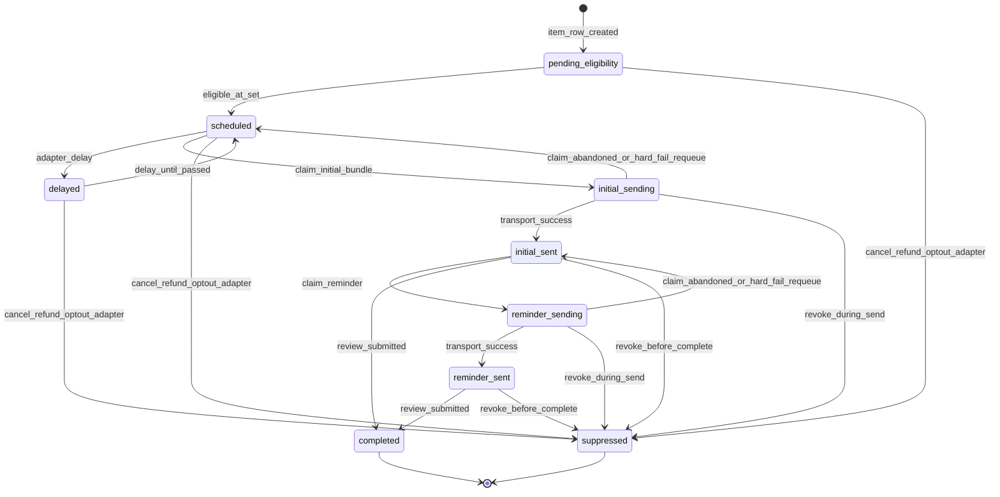
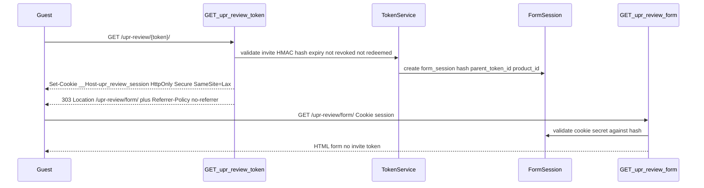

# M2 — Invitations and Guest Authorization (frozen specification)

**Status:** Frozen at `m2-invitations-freeze`. Authoritative specification for M2 implementation only.

**Baseline:** [`ARCHITECTURE.md`](../../ARCHITECTURE.md) Rev 6 (`plan-rev6-freeze`); M1 frozen at [`M1-core-enablement.md`](M1-core-enablement.md) and shipped as `v0.1.0` (`c39ce228fd0bd00704c0ae508d7aeaa93c51cdc4`); repository governance per [ADR-0001](../decisions/ADR-0001-repository-visibility.md).

**Implementation tag:** None at freeze. Release tag `v0.2.0` is created only after M2 validation is accepted (post-closure). Do not create a GitHub Release, ZIP, or production deployment as part of M2 freeze or implementation PRs.

---

## 1. Scope summary

M2 delivers generic WooCommerce review invitations and guest authorization for invitation holders, building on M1’s review-scoped hold and default-deny guest PDP guard.

### In scope

1. Custom tables `upr_invite_items`, `upr_tokens`, `upr_audit` with a versioned, locked migrator.
2. Per–`order_item_id` invitation lifecycle: eligibility, initial send, at most one reminder, suppression, completion.
3. Opaque invite tokens (HMAC-hashed at rest), token exchange endpoint, form sessions, token-free review form.
4. Guest submit via ordinary comment pipeline (`wp_new_comment()`), preserving M1 moderation; session cookie is guest auth; WP nonce is CSRF only.
5. Action Scheduler group `upr`; delivery/completed scheduling; nightly reconcile; WP-CLI reconcile and db-upgrade.
6. Generic mail transport abstraction; non-production logging/fake transport; at-least-once send claims.
7. Extension contracts for delivery, support action, mail transport, link builder, and configuration options.
8. Tests and CI policy updates scoped to authorized M2 capabilities.
9. Generic documentation updates listed in the freeze and implementation PRs.

### Out of scope (M3+)

- Host delivery, support-desk, SMTP/SES, storefront, theme, schema, or analytics **adapter implementations**
- Production or DEV host integration/deployment; bind mounts; site activation outside automated tests
- PDP styling, review-summary UI, card ratings, schema JSON-LD
- Review incentives; AI moderation/scoring; Akismet; retention/`PurgeContext` purge
- Review editing; automatic review publication
- WooCommerce `Internal\*` APIs
- Changes to global WordPress comment settings; WooCommerce review-option writes from the generic plugin
- GitHub Release / ZIP packaging / `v0.2.0` tag (until explicit post-closure acceptance)

### Constraints preserved from M1

- Native WP comments + WC ratings remain the review store.
- Global `comment_moderation` / `comment_whitelist` unchanged.
- Logged-in verified purchasers continue on native PDP; M1 hold still applies.
- Guest native PDP submissions remain **default-deny** except a verified active M2 form session for the exact canonical product.
- Host adapters stay outside this repository ([`docs/integration/adapters.md`](../integration/adapters.md)).
- Public-source hygiene ([ADR-0001](../decisions/ADR-0001-repository-visibility.md)).

### Frozen defaults

| Setting | Default |
|---------|---------|
| Delay after confirmed delivery | **10 days** (`upr_delay_days_after_delivery`) |
| Fallback after completed (no delivery) | **14 days** (`upr_delay_days_fallback_completed`) |
| Reminder after initial send | **14 days** (`upr_reminder_days_after_initial`) |
| Invite token TTL | **30 days** (`upr_token_ttl_days`) |
| Form session TTL | **45 minutes** (`upr_form_session_ttl_minutes`) |
| Abandoned send-claim stale window | **30 minutes** (`upr_send_claim_stale_minutes`) |
| Zero-total / sample lines | **Excluded** by default |
| Duplicate purchases of same product | **One invitation per eligible `order_item_id`** |
| Variation review target | **Parent product**; `variation_id` is context |
| Opt-out in M2 | Order/customer meta `_upr_review_opt_out` or adapter `suppress` — **no** self-service UI |
| Non-production email | `LoggingMailTransport` when `wp_get_environment_type()` ≠ `production` |

---

## 2. Data model

### 2.1 `{prefix}upr_invite_items`

Invitation state is keyed by immutable WooCommerce `order_item_id`.

| Column | Type | Notes |
|--------|------|-------|
| `order_item_id` | `bigint unsigned` **PK** | Immutable WC order item ID |
| `order_id` | `bigint unsigned` NOT NULL | Via `wc_get_order` |
| `product_id` | `bigint unsigned` NOT NULL | **Canonical review product** (parent for variations) |
| `variation_id` | `bigint unsigned` NULL | Context only; `NULL`/0 if simple |
| `eligible_at` | `datetime` NULL | |
| `initial_send_started_at` | `datetime` NULL | Claim start for initial bundle |
| `initial_sent_at` | `datetime` NULL | Set only after transport reports success |
| `initial_message_id` | `varchar(64)` NULL | Stable idempotency ID for this initial send |
| `initial_attempt_count` | `smallint unsigned` NOT NULL DEFAULT 0 | |
| `initial_last_error` | `varchar(191)` NULL | Truncated failure code/message |
| `reminder_send_started_at` | `datetime` NULL | |
| `reminder_sent_at` | `datetime` NULL | |
| `reminder_message_id` | `varchar(64)` NULL | |
| `reminder_attempt_count` | `smallint unsigned` NOT NULL DEFAULT 0 | |
| `reminder_last_error` | `varchar(191)` NULL | |
| `review_completed_at` | `datetime` NULL | |
| `review_comment_id` | `bigint unsigned` NULL | Durable association; set on success |
| `schedule_state` | `varchar(32)` NOT NULL | See §3 |
| `bundle_id` | `varchar(64)` NULL | Frozen membership id for an initial bundle attempt |
| `suppression_code` | `varchar(64)` NULL | e.g. `refund`, `cancel`, `opt_out`, `product_not_reviewable` |
| `delay_until` | `datetime` NULL | |
| `delivery_source` | `varchar(16)` NULL | `adapter` \| `fallback` |
| `created_at` / `updated_at` | `datetime` NOT NULL | |

**Indexes:** `(order_id)`, `(schedule_state, eligible_at)`, `(product_id)`, `(delay_until)`, `(bundle_id)`, `(initial_message_id)`, **`UNIQUE (review_comment_id)`** (MySQL allows multiple `NULL`s).

### 2.2 `{prefix}upr_tokens`

| Column | Type | Notes |
|--------|------|-------|
| `id` | `bigint unsigned` PK AI | |
| `order_item_id` | `bigint unsigned` NOT NULL | |
| `purpose` | `varchar(16)` NOT NULL | `invite` \| `form_session` |
| `token_hash` | `char(64)` NOT NULL UNIQUE | `hash_hmac('sha256', $raw, wp_salt('auth'))` |
| `parent_token_id` | `bigint unsigned` NULL | **Required for `form_session`**: logical parent invite token `id` |
| `product_id` | `bigint unsigned` NOT NULL | Canonical review product bound into session |
| `expires_at` | `datetime` NOT NULL | Invite +30d; session +45m |
| `revoked_at` | `datetime` NULL | |
| `redeemed_at` | `datetime` NULL | Invite tokens only |
| `created_at` | `datetime` NOT NULL | |
| `meta_json` | `text` NULL | Non-secret context only |

**Indexes:** `UNIQUE(token_hash)`, `(order_item_id, purpose, revoked_at, redeemed_at)`, `(parent_token_id)`, `(expires_at)`, `(purpose, expires_at)`.

### 2.3 `{prefix}upr_audit`

| Column | Type | Notes |
|--------|------|-------|
| `id` | `bigint unsigned` PK AI | |
| `occurred_at` | `datetime` NOT NULL | |
| `actor_type` | `varchar(16)` NOT NULL | `system` \| `cli` \| `customer` \| `hook` |
| `event_type` | `varchar(64)` NOT NULL | |
| `order_id` / `order_item_id` | `bigint unsigned` NULL | |
| `payload_json` | `text` NULL | **No raw secrets, no review body**; minimise PII |

**Indexes:** `(occurred_at)`, `(order_item_id, occurred_at)`, `(event_type, occurred_at)`.

### 2.4 Foreign keys

**No DB-level FKs** to WooCommerce/WordPress tables (HPOS, prefixes, multisite). Application-level integrity only. `parent_token_id` is a logical reference within `upr_tokens`, enforced in PHP.

### 2.5 Migration / upgrade (no frontend race)

- Option `upr_db_version` (e.g. `20260826`).
- **Do not** run `dbDelta` on ordinary public `plugins_loaded` requests.
- Controlled paths only:
  1. `register_activation_hook` — create/upgrade under activation lock;
  2. Admin upgrade notice + capability-gated action (`manage_woocommerce`);
  3. WP-CLI `wp upr db-upgrade`;
  4. Optional single-flight AS action `upr_db_upgrade` scheduled once when version lag detected (admin/cron context), **never** on unauthenticated front-end bootstrap.
- Migrator uses a site transient/option lock (`upr_db_migrate_lock`) with TTL; concurrent callers no-op or wait briefly then re-check version.
- Schema changes are idempotent `dbDelta` definitions in `src/Database/Schema.php`.
- Activation **must not** send email or schedule an invitation storm.
- Uninstall: **retain** tables and customer-review records by default (do not drop).

### 2.6 Token hashing and salt rotation

- Raw secrets: ≥32 bytes from `random_bytes`, URL-safe base64url.
- Store only: `hash_hmac( 'sha256', $raw, wp_salt( 'auth' ) )` → 64-char hex.
- **WordPress auth-salt rotation invalidates all outstanding invite tokens and form sessions** (by design). Operators must re-invite or rely on reminder issuance after rotation.

---

## 3. State machines



### Invite `schedule_state`

`pending_eligibility` → `scheduled` → `initial_sending` → `initial_sent` → `reminder_sending` → `reminder_sent` → `completed` | `suppressed`, with optional `delayed` detour from `scheduled`.

**Sending claims**

- Enter `initial_sending` / `reminder_sending` only via conditional UPDATE.
- Set `*_send_started_at`, allocate `*_message_id` (ULID/UUID), increment attempt count, assign/freeze `bundle_id` for initial sends **before** calling transport.
- On transport success: set `*_sent_at`, clear last error, advance state.
- On transport failure: store `*_last_error`; soft-fail retries until max attempts; then revert to `scheduled` / `initial_sent` for reconcile.
- **Abandoned claim recovery:** reconcile treats `*_sending` with `*_send_started_at` older than stale window and no `*_sent_at` as abandoned → revert state; keep `message_id` for provider-side dedupe if retried.

**Bundle freeze (order-level initial)**

- When claiming, snapshot eligible item IDs into a frozen set keyed by `bundle_id`.
- If a member becomes `suppressed` during send: omit from email body; mark that item suppressed; remaining members still send under same `bundle_id` / shared initial message identity as defined by the sender.
- Do not add newly eligible items into an in-flight bundle.
- Item state remains independent even when bundled in one email.

**Terminal rules:** at most one successful initial + one successful reminder; `completed` requires `review_comment_id` + `review_completed_at`; partial refund suppresses **only** affected `order_item_id`s.

### Invite token

`active` → `revoked` | `redeemed` | `expired` (computed). Reminder mints a new invite token and revokes the prior active invite token **and all child form sessions** (`parent_token_id`).

### Form session

`active` → `invalidated` on: expiry; successful redeem; parent invite revoke/redeem/replace; item suppress (refund/cancel/opt-out); product not reviewable; explicit invalidate.

---

## 4. Security model

### 4.1 Token exchange (form never at token URL)



Requirements:

1. Invite token appears **only** on the short-lived exchange URL.
2. Form and POST URLs are **token-free**; form HTML never embeds the invite token.
3. Opening an invite token creates a form session and **does not** redeem the invite token.
4. **303** redirect to the token-free form URL after successful exchange.
5. Always set `Referrer-Policy: no-referrer` on the token-exchange response (prefer same on form endpoints).

### 4.2 Cookie design

**HTTPS / production (required when HTTPS is available):**

- Name: `__Host-upr_review_session`
- Value: raw session secret
- Flags: `Secure`, `HttpOnly`, `SameSite=Lax`
- `Path=/`
- **No** `Domain` attribute (required by `__Host-`)
- Lifetime ≤ session TTL (45 minutes absolute; no sliding refresh)

**Local-development exception (must be impossible in production):**

- Allowed only when **all** of: `wp_get_environment_type()` is `local` or `development`, **and** the request is not SSL, **and** environment type is **not** `production` / `staging`.
- Use non-prefixed name `upr_review_session` without requiring `Secure` / `__Host-`; still `HttpOnly` + `SameSite=Lax`.
- If environment type is `production` or `staging`, the exception path **must not** run (reject or require HTTPS / `__Host-`).

### 4.3 Host access-log duty

Hosts **must** redact or exclude `/upr-review/{token}/` (and equivalent rewrite paths) from web-server access logs so the bearer token is not retained in log pipelines. Documented in host integration checklist; core cannot enforce nginx/apache config. See [`docs/runbooks/token-incidents.md`](../runbooks/token-incidents.md).

### 4.4 Form-session authentication

WordPress nonces are **CSRF only**, not authentication for logged-out users.

1. Opaque session secret (≥32 bytes); store **only** HMAC hash in `upr_tokens`.
2. Bind session to: `order_item_id`, canonical `product_id`, `parent_token_id`.
3. Cookie carries raw secret; server looks up by HMAC (constant-time compare).
4. Validate session in form GET, form POST, and `GuestSubmissionGuard` (`comment_post_ID === session.product_id`).
5. CSRF: separate WP nonce bound to session id **in addition to** cookie auth.
6. On parent invite revoke/redeem/reminder-replace/item suppress/product not reviewable: revoke invite and `UPDATE upr_tokens SET revoked_at = NOW() WHERE parent_token_id = ? OR id = ?`.
7. Do **not** create a broad request parameter, data filter, or test seam that bypasses guest authorization.

### 4.5 Link building (sensitive)

```php
interface ReviewLinkBuilder {
  public function invite_exchange_url( string $raw_invite_token ): string;
  public function form_url(): string; // token-free
}
apply_filters( 'upr_review_link_builder', ReviewLinkBuilder $builder );
apply_filters( 'upr_review_form_base_url', $default_form_base ); // no secrets
```

**Forbidden:** public filters that receive raw invite/session secrets (no `upr_review_page_url( $url, $raw_token )`).

Never expose invite/session secrets in rendered HTML, query strings (except the exchange path itself), audit entries, application logs, or public filters.

### 4.6 Threat mitigations

| Threat | Mitigation |
|--------|------------|
| Token in history/access logs | 303 exchange; no form on token URL; never log raw secrets; host access-log redaction; `Referrer-Policy: no-referrer` |
| Token/session replay | Redeem invite only after successful comment; conditional SQL on `redeemed_at IS NULL`; invalidate sessions |
| Enumeration | 256-bit secrets; generic 404/410 |
| Cross-item access | Session binds item + product; submit rejects mismatch |
| Race on redeem | Single-winner UPDATE; one `review_comment_id` |
| CSRF | Nonce + SameSite cookie |
| Cookie scope / fixation | `__Host-` on HTTPS; production cannot use local-dev exception |
| Discontinued product new reviews | Revoke tokens/sessions; reject submit; keep approved reviews visible |
| Salt rotation | All outstanding HMAC verifications fail |

---

## 5. Eligibility, identity, and discontinued products

### 5.1 Line-item eligibility (new invitations)

Include only if **all** hold:

- Line item is a product line (not fee/shipping/tax/coupon);
- Product type is reviewable (`simple` / `variable` / variation → parent); default include virtual unless `upr_item_is_reviewable` returns false;
- Not free/sample: `line_total > 0` **or** filter override; default **exclude** zero-total sample/gift lines;
- Canonical product post exists and is **reviewable** (default: status `publish` and passes `upr_product_is_reviewable`; discontinued/hidden/trashed/deleted ⇒ not reviewable);
- Item not refunded/cancelled; order not failed/cancelled;
- No `_upr_review_opt_out` on order/customer;
- Support filter ≠ `suppress`.

**Duplicates:** multiple purchases of the same product → multiple invite rows (one per `order_item_id`). Completing one item does not complete siblings.

**Canonical product:** for variations, `product_id` = parent product ID; `variation_id` retained; comment `comment_post_ID` = parent product.

### 5.2 Discontinued / not reviewable (product policy)

- Existing **approved** reviews remain visible (theme/storefront; UPR does not hide them).
- **No new invitations** for that product.
- A valid session is still a **new submission** — therefore when the canonical product becomes discontinued/hidden/not reviewable: **revoke** outstanding invite tokens and child form sessions, suppress further sends (`suppression_code` e.g. `product_not_reviewable`), and **reject** token exchange, form render, and submit with a generic unavailable response.
- Reconcile and product-status hooks enforce the same revocation.

### 5.3 Guest submit identity and rating

- Author **name** and **email** from the **purchased order** billing fields (public order API), **not** arbitrary POST identity fields.
- Required rating integer **1–5** in plugin handler; reject otherwise before comment insert.
- Content: required non-empty sanitized review text (min length filter, default 1).
- If product not reviewable: revoke + reject; do not insert a comment.

### 5.4 Submit transactional boundary

Prefer `wp_new_comment()` so M1 moderation + WC pipeline run. Public WordPress/WooCommerce APIs only — **no** `Internal\OrderReviews`.

**Order of operations:**

1. Validate session cookie + CSRF nonce + product still reviewable + eligibility + rating; if not reviewable → revoke + reject (no comment).
2. `wp_new_comment()` → `$comment_id` (pending via M1 hold).
3. In a DB transaction (UPR tables): set invite `review_comment_id`, `review_completed_at`, `schedule_state=completed`; redeem invite token; revoke sibling invite tokens for that item + all child sessions; write audit.
4. Add comment meta `_upr_order_item_id`, `_upr_variation_id` (best-effort; reconcile can repair).

**If step 2 succeeds and step 3 fails:** comment exists without UPR completion → **reconcile** detects associated orphaned reviews (via `_upr_order_item_id` and/or controlled heuristics), attaches `review_comment_id`, completes item, revokes tokens — **never** re-invite an already-created associated review. Inverse orphan (UPR completed without comment) is invalid and audited as error.

### 5.5 M1 guest guard interaction

`GuestSubmissionGuard`: allow logged-out in-scope review **only** if `FormSessionAuthenticator` validates an active session cookie for that exact canonical product; else existing `wp_die` / reject behaviour. No broad bypass filter or test seam.

Availability filters may report `can_submit: true` with context `authorization: form_session` when an active session matches; without session remain `guest_requires_invitation`.

---

## 6. Public extension API contracts

### Delivery

```php
do_action( 'upr_order_delivery_confirmed', int $order_id, array $context );
do_action( 'upr_order_delivery_invalidated', int $order_id, string $reason );
apply_filters( 'upr_is_order_delivered', false, int $order_id );
```

Core never reads fulfillment plugin tables.

### Invitation action (support)

```php
apply_filters( 'upr_review_invitation_action', [ 'action' => 'none' ], $order_id, $order_item_id );
// returns action: none|delay|suppress (+ optional code, delay_until)
```

### Email transport

```php
interface MailTransport {
  public function send( EmailMessage $message ): SendResult;
}
apply_filters( 'upr_mail_transport', ?MailTransport $transport );
```

- Default production: `WpMailTransport` (`wp_mail`).
- Default non-production: `LoggingMailTransport` (no real email).
- Host SES/SMTP wrappers live **outside** core.
- `EmailMessage` carries stable UPR-generated `message_id` for provider-level idempotency.

### Configuration options

| Option key | Default |
|------------|---------|
| `upr_delay_days_after_delivery` | `10` |
| `upr_delay_days_fallback_completed` | `14` |
| `upr_reminder_days_after_initial` | `14` |
| `upr_token_ttl_days` | `30` |
| `upr_form_session_ttl_minutes` | `45` |
| `upr_send_claim_stale_minutes` | `30` |

---

## 7. Action Scheduler, email, and delivery semantics

**Group:** `upr`

| Hook | Purpose | Unique key pattern |
|------|---------|-------------------|
| `upr_schedule_order_items` | Upsert invite rows | `order:{id}:schedule` |
| `upr_send_initial_bundle` | Claim + send frozen bundle | `order:{id}:initial:{bundle_id}` |
| `upr_send_reminder_item` | Claim + send reminder | `item:{order_item_id}:reminder:{message_id}` |
| `upr_reconcile_invitations` | Nightly repair | `reconcile:{Ymd}` |
| `upr_db_upgrade` | Locked schema upgrade | `db_upgrade:{target_version}` |

**Scheduling**

- After confirmed delivery: schedule eligibility at delivery + 10 days.
- Completed-order fallback (+14 days) **only** where delivery confirmation is absent.
- Reminder: one per item, default 14 days after `initial_sent_at`, if not completed/suppressed.
- Before send: re-check eligibility, support filter, token state, product reviewability.
- Unschedule/revoke on terminal states (completed, suppressed).

### At-least-once email (explicit)

Generic `wp_mail()` / `WpMailTransport` provides **at-least-once**, **not** exactly-once delivery. A process may send successfully and crash before persisting `*_sent_at`.

**Send algorithm**

1. Conditionally claim rows → `initial_sending` / `reminder_sending`; set started_at; ensure `message_id`.
2. Freeze bundle membership for initials.
3. Call transport with `message_id` in headers/`EmailMessage`.
4. On success → set `*_sent_at`, advance state, audit `email.sent`.
5. On failure → record error; retry via AS; after max attempts revert claim for reconcile.
6. Provider adapters **may** use `message_id` as their own idempotency key; core still assumes at-least-once.

Action Scheduler uniqueness alone is **not** sufficient without claim fields.

### Email content

- One initial email may bundle several eligible product links for one order/customer.
- Each product link remains separately authorized and independently revocable.
- Generic i18n subject/body; product name + exchange URL only; no host branding in core.
- **No** order ID, order key, email address, or other customer identity in URLs.
- Reminder: new invite token; revoke previous invite + child sessions.
- No real email in local, development, test, or staging environments.

---

## 8. CLI and reconciliation

```bash
wp upr reconcile-invitations [--lookback-days=90] [--dry-run]
wp upr db-upgrade
```

**Reconcile behaviour**

- Scan orders via `wc_get_orders` (HPOS-safe).
- Upsert missing invite rows; repair eligibility; suppress refunded/cancelled/opted-out/not-reviewable lines; revoke tokens/sessions; recover abandoned `*_sending` claims; attach orphaned reviews to `review_comment_id` without re-inviting.
- Capability: `manage_woocommerce`.
- Nightly AS runs reconcile **without** dry-run.

**Dry-run**

- `--dry-run` performs **no writes at all** — including **no audit rows**.
- Print a structured summary to stdout (counts, sample IDs).
- Auditability of reconcile runs happens only on non-dry-run (`event_type = reconcile.completed`).

---

## 9. Work packages

### WP-A — Schema and locked migrator

- **Files:** `src/Database/Schema.php`, `Migrator.php`, activation hook, `wp upr db-upgrade`, admin upgrade gate
- **Validate:** no `dbDelta` on anonymous front-end; lock prevents double migrate; HPOS site boots
- **Rollback:** deactivate plugin; tables retained
- **Done:** `upr_db_version` set; migrate tests green

### WP-B — Eligibility, claims, AS scheduling

- **Files:** `src/Invitations/*`, refund/cancel/delivery/product listeners, claim/bundle logic
- **Validate:** 10d/14d; suppress/delay; partial refund; abandoned claim recovery; bundle freeze with mid-send suppress; discontinued revocation
- **Rollback:** unschedule `upr` group actions
- **Done:** state machine + claim tests green

### WP-C — Tokens, sessions, redirect endpoint

- **Files:** `src/Tokens/*`, `src/Http/*`, `ReviewLinkBuilder`, `GuestSubmissionGuard` session allowlist
- **Validate:** 303 + `Referrer-Policy: no-referrer`; `__Host-` cookie on HTTPS; local-dev exception impossible in production; no token in form; discontinued rejects; parent_token_id cascade
- **Rollback:** flush rewrites; deactivate
- **Done:** pipeline security tests green

### WP-D — Email transport and at-least-once claims

- **Files:** `src/Email/*`, send handlers using `message_id` + claim fields
- **Validate:** logging transport in non-prod; zero real email outside production; reminder rotates tokens; crash-between-send-and-persist recovery
- **Rollback:** cancel AS; no outbound mail
- **Done:** no `wp_mail` assertions in non-prod tests

### WP-E — CLI, reconcile, docs, CI

- **Files:** CLI, docs updates, CI policy updates scoped to M2, CHANGELOG
- **Validate:** dry-run zero writes; orphan comment repair; nightly action; Internal API ban remains
- **Done:** acceptance checklist; prepare `0.2.0` only after explicit post-closure acceptance

---

## 10. Test requirements

### Unit

- Eligibility matrix; HMAC verify; session bind; state/claim transitions; link builder never exposes secrets to filters; mail transport selection; production cookie exception denial.

### Integration (mandatory CI leg)

Coordinates remain **PHP 8.4**, **WordPress 7.0.2**, **WooCommerce 11.0.1** (HPOS-on mandatory).

| ID | Criterion |
|----|-----------|
| AC-M2-1 | Fresh install + idempotent upgrade under migrator lock |
| AC-M2-2 | No unconditional `dbDelta` on public front-end bootstrap |
| AC-M2-3 | Delivery path schedules at +10d; completed fallback +14d only without delivery |
| AC-M2-4 | Initial + at most one reminder; delay/suppress/cancel/refund/partial refund/opt-out |
| AC-M2-5 | Bundle construction; independent item revocation mid-bundle |
| AC-M2-6 | Abandoned send-claim recovery; AS idempotency |
| AC-M2-7 | Token exchange → 303 + cookie + `Referrer-Policy`; open ≠ redeem |
| AC-M2-8 | Form token-free; HMAC-only storage; expired/revoked/replaced/wrong-item fail |
| AC-M2-9 | `__Host-` attributes on HTTPS; local-dev exception blocked in production |
| AC-M2-10 | Guest PDP blocked without session; allowed only via real pipeline with session |
| AC-M2-11 | Rating 1–5 required; author identity from order |
| AC-M2-12 | Concurrent submit → at most one review; `review_comment_id` set |
| AC-M2-13 | Orphaned-review reconcile repairs; never re-invites |
| AC-M2-14 | Discontinued product revokes tokens and rejects submission |
| AC-M2-15 | Variation reviews target parent product |
| AC-M2-16 | No real email outside production (`LoggingMailTransport`) |
| AC-M2-17 | CLI `--dry-run` zero writes including audit |
| AC-M2-18 | M1 regression: hold, whitelist/moderation options unchanged, WC type order |
| AC-M2-19 | CI bans `Internal\` WooCommerce APIs and prohibited host-specific strings |

Optional classic storage compatibility leg where the repository matrix supports it (non-blocking if already optional).

---

## 11. Acceptance criteria (closure themes)

Implementation PR closure must demonstrate:

- Schema/migrator evidence (lock, activation, CLI upgrade).
- Token/session security evidence (303, `__Host-`, Referrer-Policy, no secret leakage).
- Guest pipeline evidence (default-deny + session allow via `wp_new_comment`).
- Scheduling, send-claim, bundle, and reconciliation evidence.
- No-real-email evidence outside production.
- HPOS and M1 regression evidence.
- Green CI on the implementation PR.
- Diff contains no host adapter runtime code and no M3+ capability.
- No GitHub Release, ZIP, production/DEV host deploy, or `v0.2.0` tag.

---

## 12. Rollback requirements (generic)

1. Deactivate UPR plugin (or revert to `v0.1.0`).
2. Unschedule Action Scheduler actions in group `upr`.
3. Leave `upr_*` tables in place by default (data retention).
4. Leave existing WP comments / ratings in place.
5. Confirm guest PDP block returns to M1-only behaviour if M2 code is removed; with M2 code deactivated, no invitation endpoints.

Host-specific rollback steps live in host-side documentation only.

---

## 13. Explicit exclusions checklist

Implementation must **not** introduce:

- Host adapter implementations (delivery/support/SMTP/SES/storefront/theme/schema/analytics)
- Production or DEV host deployment / bind-mount activation outside automated tests
- PDP/theme CSS, card ratings, schema JSON-LD emitters
- Review incentives, AI scoring, Akismet integration, retention purge jobs
- Review edit flows or auto-approval / auto-publish
- Imports from `Automattic\WooCommerce\Internal\*`
- Writes to global comment options or WC review feature options
- Public filters that receive raw invite/session secrets
- Broad guest-auth bypass seams
- Unconditional `dbDelta` on ordinary public requests
- Claims of exactly-once email delivery
- GitHub Release, release ZIP, or `v0.2.0` tag before explicit acceptance

---

## 14. Freeze statement

This document is materialised at M2 plan freeze (`m2-invitations-freeze`). Runtime implementation begins only after this tag exists on generic `main` at the freeze PR merge commit. Host-side integration (access-log redaction, adapters) remains outside this repository and is not part of the M2 implementation PR.
