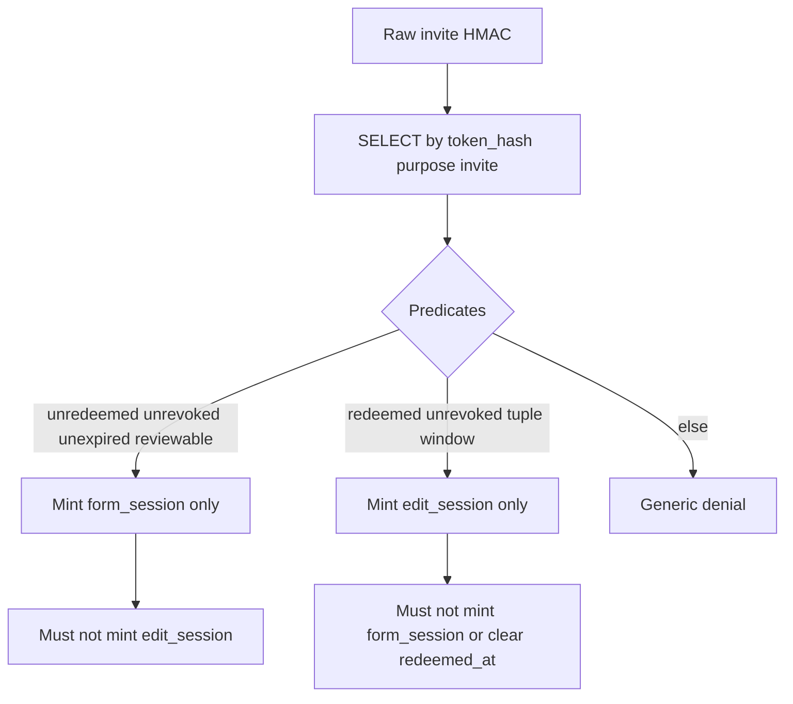

# M14 — Customer 7-day review edits (authoritative freeze)

**Status:** Frozen M14 **product and implementation** specification. Authorises **documentation freeze** and **subsequent implementation on this freeze**. Does **not** authorise Calibration GO, production enablement, DEV/production WordPress access, credentials, provider configuration, external-AI enablement, email, auto-spam master enablement, host-specific code, GitHub Release, ZIP, plugin SemVer / version tag, or movement of `v0.8.0`.  
**Baseline:** Universal Product Reviews `main` @ **`2f81225a835fc9706353c811bbbba465991493b0`** (PR [#71](https://github.com/magpern/universal-product-reviews/pull/71) — M13 operator command-surface closure). Runtime remains **`0.8.0`**.  
**Freeze tag:** `m14-customer-seven-day-review-edits-freeze` (annotated; peels to the merge commit of this freeze).

**Related:** [`m13-operator-ai-command-surface.md`](m13-operator-ai-command-surface.md), [`m5-review-moderation-operations.md`](m5-review-moderation-operations.md), [`../../ARCHITECTURE.md`](../../ARCHITECTURE.md) §12.

Generic core only: no host-, brand-, theme-, or infrastructure-specific runtime code. No WooCommerce `Internal\*` APIs. Support export schema **`upr-support-export/v1` unchanged**. No new public `upr_*` host filters. No new Action Scheduler hook.

This freeze **amends** ARCHITECTURE §12: the clock is **submission GMT** (`comment_date_gmt`), not first approval (`_upr_approved_at` is named in ARCHITECTURE but **not implemented**); “audit row per revision” means a **privacy-safe event**, not stored prior bodies. Guest proof is a **scoped completed-invite lookup** of the original invite HMAC — not M2-active `find_active_by_raw`.

**Contract ID:** Planning referred to the read-only display helper as “C18”. Registry **C18** is already `DeliveryStatus::has_confirmation`. This freeze locks the helper as **C20** (provisional). Do not reuse C18.

---

## 0. Problem and users

**Problem:** Legitimate authors cannot correct body or star rating after submit. Native WordPress comment edit is operator-only and is not a customer-safe path.

**Users:** (a) Logged-in verified-purchaser PDP authors. (b) Invited guests who already completed a review via the original invitation secret.

**Milestone role:** Controlled 7-day self-edit of **body + rating only**, through one UPR-owned token-free route, returning edited public content to moderation hold. Never a second submission. Never a new customer-visible secret or email.

---

## 1. Locked decisions (E1–E33)

### Eligibility and identity

| ID | Decision | Locked value |
|----|----------|--------------|
| **E1** | Author classes | (a) Logged-in verified-purchaser PDP (`user_id > 0`). (b) Invited guests (`user_id = 0`, invitation-linked). No third class (email-matched later accounts, order-key holders, cookie leftovers). |
| **E2** | Logged-in proof | All required on every request: in-scope top-level `comment_type=review` on `product`; `get_current_user_id() === (int) comment.user_id` and `user_id > 0`; `wc_customer_bought_product()` for the canonical product; `comment_post_ID` equals that product; E8–E11. Invitation linkage is **not** a substitute for `user_id` match. |
| **E3** | Guest proof | Dedicated completed-invite lookup of the **original raw invite HMAC**. Not `find_active_by_raw`. See §2. |
| **E4** | Completion vs security revoke | M2 completion (`redeemed_at` only) is **not** a security revoke. `TokenRepository::revoke( $id )` on a redeemed invite **is**. See §2. |
| **E4b** | Route reuse | No 7-day cookie. Leftover `form_session` is never edit auth. Invite `expires_at` is **ignored on the edit-lookup path only**; the seven-day comment clock governs. |
| **E5** | Never sufficient alone | Cookie, URL/query/path (including comment ID), email, posted name/email/`user_id`, order key, `order_item_id`, guessed IDs. Comment ID is a **resource locator** only. |
| **E6** | Cross-customer | Session/product/item/comment tuple must match. Guest cannot edit a logged-in review; logged-in user cannot claim a guest review via billing-email match. |

### Native-update guard

| ID | Decision | Locked value |
|----|----------|--------------|
| **E7** | Write guard | `wp_update_comment_data` is **mandatory** for in-scope comment-row updates. Permit only if `CustomerEditAuthorization` is armed for this exact `comment_ID` (body-only among persisted columns) **or** current user has `moderate_comments`. Else `WP_Error`. REST/admin/`map_meta_cap` are **additional** denials, not substitutes. Rating meta: same arm or `moderate_comments` on `add_comment_metadata`, `update_comment_metadata`, **and** `delete_comment_metadata` when `meta_key === 'rating'` for in-scope reviews. Customers never gain `edit_comment`. |

### Seven-day window

| ID | Decision | Locked value |
|----|----------|--------------|
| **E8** | Clock | `comment_date_gmt` parsed as UTC + **7 × 86400** seconds. `current_time( 'timestamp', true )` / `time()` for now. Missing/invalid GMT → deny. Independent of `_upr_approved_at`. |
| **E9** | Boundary | Allowed while `now_utc <= expiry` (inclusive). Denied when `now_utc > expiry`. Re-checked at GET, POST, claim acquire, and persist. |
| **E10** | Status | `hold` / `approve` eligible if in window. `spam`, `trash`, `delete`, replies, out-of-scope: **never**. Invite `completed` does not extend the clock. |
| **E11** | Status revokes | Transition to spam/trash/delete immediately revokes, including in-flight claims. Approve↔hold does not move the clock. |

### Route and session

| ID | Decision | Locked value |
|----|----------|--------------|
| **E12** | Surface | Token-free `/upr-review/edit/` (rewrite **before** the token catch-all; bump `RewriteRules::VERSION`). Guest entry remains `/upr-review/{token}/` (303, `Referrer-Policy: no-referrer`). |
| **E13** | Token-free HTTP | No invite/edit secret in HTML, query, or logs. CSRF + session/user binding. `nocache_headers()` + no-referrer (M7). Generic 403/404/410; no existence oracle. |
| **E14** | Request-local arm | Arm only after validation + durable claim; `try/finally` clear. Clone `ReviewSubmitHandler`. |
| **E15** | Hidden / post-complete suppress | C9/C10/guards still block **new submits**. Edit of an **existing** comment is allowed in-window even if the product is later not reviewable or the invite row is `suppressed` after `completed`. Successful approve edits still go to hold (E23). Spam/trash still revoke. |

### Payload

| ID | Decision | Locked value |
|----|----------|--------------|
| **E16** | Subset | Body + rating integer 1–5 only. No title, media, identity, post ID, parent, type, dates, `_upr_order_item_id` / `_upr_variation_id`. |
| **E17** | Sanitisation | Same pipeline as submit. Identical body+rating → **no-op** (release claim; no re-hold, skip, or `review.customer_edited`). |
| **E18** | Rating aggregates | Public `WC_Comments::clear_transients( $product_id )` on WC **8.2.0** and **11.0.1**. Never `Internal\*`. See §5. |
| **E19** | Deletion | **No** customer deletion in M14. |

### Claims, finalisation, history

| ID | Decision | Locked value |
|----|----------|--------------|
| **E20** | Durable claim | Table `{prefix}upr_review_edit_claims`, PK `comment_id`. `writing` and `content_written` are **recovery-owned** even after 5 min TTL. See §4. |
| **E21** | Write protocol | Authorise → canonical HMAC → compute `content_changed`/`rating_changed` → acquire (store flags + prior fingerprints) → **commit `writing` checkpoint** → transactional body + rating + `content_written` CAS → E33. Rollback of that unit leaves no persisted edit. Reconcile via existing `upr_reconcile_invitations` only. |
| **E33** | Finalisation | Per-generation lease (60s); `ApproveToHoldCas`; clear AI claims **before** skip; UNIQUE skip + UNIQUE audit insert-or-detect. See §4. |
| **E22** | History | No revision-body store. Event `review.customer_edited` only. HMAC is recovery proof, not history. |

### Moderation, audit, AI

| ID | Decision | Locked value |
|----|----------|--------------|
| **E23** | Post-edit status | Approve→hold **only if still `'1'`** at `ApproveToHoldCas`. Already hold → stay. Spam/trash/deleted → **abandon**; operator wins; never restore hold. |
| **E24** | Audit | `actor_type=customer`; allowlisted payload including opaque `finalise_op_id` and stored booleans `content_changed` / `rating_changed` (computed before write, not hardcoded). `UNIQUE(event_type, correlation_id)` insert-or-detect. **Forbidden:** body, diff, hmac, email, token, rating **value**. |
| **E25** | AI invalidation | On **completed** E33 only: clear active claims, insert skipped `content_edited` keyed by `source_op_id=finalise_op_id`. Masters remain default-off. |
| **E26** | Privacy | No tokens/URLs/emails/bodies/keys/prompts/hmacs/revision text in diagnostics, logs, audit, CLI, HTML, or SupportExport. `finalise_op_id` allowed on the customer-edit audit event and assessment row only. |

### Compatibility

| ID | Decision | Locked value |
|----|----------|--------------|
| **E27** | **C20** (provisional, sensitivity none) | Read-only `CustomerEditAvailability::resolve( int $comment_id, int $user_id ): array{ can_edit: bool, reason_code: string }`. **No** `apply_filters` that can force `can_edit=true`. No UPR theme/block UI. Guest edit UI is **only** `/upr-review/edit/` (M7 a11y). |
| **E28** | Schema | Yes: `upr_review_edit_claims` (incl. `writing` phase, change flags, prior fingerprints); `upr_moderation_assessments.source_op_id char(36) NULL UNIQUE`; `upr_audit.correlation_id char(36) NULL` + `UNIQUE(event_type, correlation_id)`; `upr_db_version` bump (`20260831b`). `edit_session` reuses `upr_tokens.purpose` (`varchar(16)`). No new AS hook. |
| **E29** | Token route | One HMAC `SELECT` then dispatch. See §3. |
| **E30** | Reissue | Serialized per parent invite. 10 mints/hour including revoked. See §3. |
| **E31** | Aggregate proofs | WC 8.2.0 floor + WC 11.0.1 DEV. See §7. |
| **E32** | HMAC canonicalisation | HMAC of exact post-kses `comment_content`. Never emit hmac/claim_token. |

---

## 2. Guest proof: scoped completed-invite lookup (E3 / E4)

M2 stays unchanged:

- `TokenService::exchange_invite` / `TokenRepository::find_active_by_raw( …, 'invite' )` require `redeemed_at IS NULL` **and** `revoked_at IS NULL`.
- `TokenService::redeem_after_submit` sets **`redeemed_at` only** and `revoke_children` (form sessions). It does **not** set `revoked_at` on the invite.
- That consumed secret **must never** mint a `form_session` or arm `GuestSubmitAuthorization`.

M14 lookup (name illustrative: `find_completed_invite_for_edit`):

**One** `SELECT` by `token_hash` + `purpose='invite'` (same HMAC as `find_active_by_raw`), then predicates in PHP. Do **not** call `find_active_by_raw` for edit. Do **not** treat a null active lookup as proof of completion.

Match the original raw invite secret **only when all** hold:

- `purpose='invite'`
- **`redeemed_at IS NOT NULL`**
- **`revoked_at IS NULL`**
- invite `order_item_id` / `product_id` match `upr_invite_items` **and** comment `_upr_order_item_id` / `comment_post_ID`
- `upr_invite_items.review_comment_id` equals this comment
- E8–E11 on that comment
- invite `expires_at` **ignored** on this path

**Must never:** clear `redeemed_at`; clear `revoked_at`; mint `form_session`; call `exchange_invite`; treat the invite as active for reminders, second submit, or `find_active_invite`. May mint **only** `purpose=edit_session` with `parent_token_id` = that invite id. CSRF + `edit_session` cookie + request-local arm remain required on `/upr-review/edit/`.

| Event | Invite row | M2 submit / `form_session` | M14 edit lookup |
|-------|------------|----------------------------|-----------------|
| Unused, valid | both timestamps NULL | Yes | No (submit branch only) |
| Successful submit | `redeemed_at` set, `revoked_at` NULL | **No** | **Yes** if tuple+window |
| Reminder replace / unused-item suppress / cancel before complete | `revoked_at` set | No | No |
| Item `suppressed` **after** `completed` | Token **unchanged** | No | **Yes** (E15) |
| Security revoke of a redeemed invite via `TokenRepository::revoke( $id )` | `revoked_at` set even if redeemed | No | **No** |
| Auth-salt rotation | HMAC miss | No | **No** |

Do **not** extend `revoke_for_item` / `revoke_all_outstanding` to mass-revoke redeemed invites (that would kill in-window guest edits on refund/opt-out, contradicting E15). No second customer-visible secret. No email.

---

## 3. Token route and E30 serialized reissue

### E29 — `/upr-review/{token}/`

One handler; no distinct URL. **One** HMAC `SELECT` by `token_hash` + `purpose='invite'`, then dispatch. Never mint both session types in one request.

| Condition | Outcome |
|-----------|---------|
| Unredeemed, unrevoked, unexpired invite; product still reviewable | **Submission-session only** (`form_session` + 303 `/upr-review/form/`). Must not mint `edit_session`. Must not fall through to completed-invite predicates. |
| E3 completed-invite proof | **Edit-session only** (303 `/upr-review/edit/`). Must not mint `form_session`, must not clear `redeemed_at`, must not allow a second submit. |
| Any other outcome | **Generic denial** (same 404/410 family and copy as today’s unavailable invitation). |

No branch may vary status text, timing, or headers in a way that reveals whether a comment, order, or review exists.

**Mandatory tests:** the **same raw secret** after submit (a) 303s to `/upr-review/edit/` when eligible; (b) `find_active_by_raw(..., 'invite')` is still null; (c) POST `/upr-review/form/` cannot insert another review; (d) `GuestSubmitAuthorization` remains unarmed without an M2 form session; (e) security-revoked redeemed invite → generic denial, still no second submit.

### E30 — serialized mint (critical)

Creating an `edit_session` from a redeemed invite is **not** single-use. Until the seven-day window expires, a successful E29 edit-branch visit **may mint** a new short-lived `edit_session` (TTL = `upr_form_session_ttl_minutes`, default 45). **At most one active** `edit_session` per parent. Constant **10 / rolling hour / parent invite**. Count **revoked and unrevoked** `purpose='edit_session'` children with `created_at >= UTC_TIMESTAMP() - INTERVAL 1 HOUR`. No new table. Existing valid edit-session **cookie** may use `/upr-review/edit/` without minting.

**Mint MUST run in one InnoDB transaction per parent invite** (`START TRANSACTION` + `SELECT … FOR UPDATE` on the parent invite PK — same pattern as `AssessmentWorker` / `ActionWorker`). Check-then-act without the lock is forbidden: two concurrent token-link visits can otherwise both observe count `< 10`, both revoke the same prior child, and both insert — **11 rows/hour and two active sessions**.

Locked sequence (cookie **after** commit; never set a cookie for a rolled-back mint):

1. `START TRANSACTION`.
2. `SELECT * FROM {prefix}upr_tokens WHERE id = %d FOR UPDATE` on the **parent invite** row. Missing row → `ROLLBACK`, generic denial.
3. **Re-check** E3 eligibility on that locked row. Fail → `ROLLBACK`, generic denial, **do not** revoke children.
4. **Re-count** rolling-hour `edit_session` children (revoked + unrevoked). If count **≥ 10** → `COMMIT` or `ROLLBACK` with **no writes**; generic denial (same E29 copy — no “rate limit” wording). **Must not revoke** on this path.
5. If count **< 10**: revoke unrevoked children with `purpose='edit_session'` and this `parent_token_id` only (do **not** `revoke_children` of every purpose; do **not** touch the invite; do **not** clear `redeemed_at`). `INSERT` **exactly one** `edit_session`. `COMMIT`. Then set the session cookie.

**Mandatory interleaving integration test:** seed **9** `edit_session` rows in the rolling hour; two concurrent token-route visits; assert one mint and one generic denial; hour `COUNT(*)` **= 10**; **exactly one** unrevoked `edit_session`. Two concurrent visits with count `0` still leave **at most one** active session. Never 11. Never two active.

---

## 4. Claims, `ApproveToHoldCas`, and E33

### E20 — `{prefix}upr_review_edit_claims`

PK `comment_id`. One in-flight claim per comment.

| Field | Role |
|-------|------|
| `comment_id` | Immutable |
| `claim_token` | UUID; CAS key |
| `generation` | Incremented on acquire |
| `auth_class` | `logged_in` \| `guest_session` |
| `target_content_hmac` | HMAC-SHA256 of canonical sanitised body with `wp_salt( 'auth' )` — **never store raw body** |
| `target_rating` | Tinyint 1–5 |
| `prior_content_hmac` / `prior_rating` | Fingerprints of live body+rating at acquire (recovery only; not audit) |
| `content_changed` / `rating_changed` | Booleans computed before mutation; copied into `review.customer_edited` |
| `prior_status` | `hold` / `approve` at acquire |
| `phase` | `claimed` \| `writing` \| `content_written` |
| `claimed_at` / `content_written_at` | UTC |
| `finalise_op_id` | Opaque UUID; NULL until `content_written`; then immutable for the generation |
| `finalise_lease_token` / `finalise_lease_expires_at` | Exclusive E33 owner; TTL **60 seconds** |
| `finalized_at` / `finalise_outcome` | NULL \| `completed` \| `abandoned` |
| `finalise_reassess` | `none` \| `scheduled` \| `ineligible` |
| `claim_expires_at` | **5 minutes** from acquire; **does not** release `content_written` |
| `updated_at` | UTC |

**Acquire:** allowed when no row; **or** `finalized_at` set; **or** `phase=claimed` and `content_written_at IS NULL` and expired. **Forbidden** when `phase=writing` or `phase=content_written` and `finalized_at IS NULL`, **including after TTL**. Concurrent POST → generic **409**. Acquire `WHERE` must never match `writing` or `content_written` in-flight rows.

### E21 request path

1. Authorise (E2 or E3) + window/status. Canonicalise body. HMAC. Reject no-op before acquire. Compute `content_changed` / `rating_changed` from live vs target.
2. Acquire claim (store flags + prior fingerprints).
3. **CAS `phase=writing`** (durable checkpoint **before** any comment mutation).
4. Arm `CustomerEditAuthorization` (comment_id + claim_token + generation).
5. **One InnoDB transaction:** body write (if content changed); rating meta (if rating changed); fingerprint re-read; CAS `phase=content_written` + mint `finalise_op_id` if NULL. Failure or crash → `ROLLBACK` (no persisted edit). **No E33 side effect before this CAS.**
6. Enter E33 (lease + `ApproveToHoldCas`). Spam/trash/deleted → abandon.
7. `finally`: clear arm; clear edit_session cookie on success.

**Reconcile** (existing `upr_reconcile_invitations` + `wp upr reconcile-invitations` only):

- Expired `claimed` with no `content_written` and **not** `writing` → release (reacquire allowed).
- `writing` without `finalized_at` (**ignore expiry**): never treat as safely unwritten. Target fingerprint match → CAS `content_written` then E33. Live still equals prior fingerprints (rolled-back unit) → abandon generation only. Partial (target body, stale rating) → finish rating then E33. Otherwise **abandon the generation with no comment-status write**, no skip, no `review.customer_edited` (mismatch cannot be attributed to the claim; preserve live/external status).
- `content_written` without `finalized_at` (**ignore expiry**): fingerprint match → E33; mismatch/missing comment → abandon that generation.

### `ApproveToHoldCas`

New class `src/Moderation/ApproveToHoldCas.php`. Clone the contract of `src/Moderation/HoldToSpamCas.php`: `cas_write()` + `deliver_hooks_after_successful_cas()`.

- `cas_write()`: `UPDATE comments SET comment_approved='0' WHERE comment_ID=%d AND comment_approved='1'`.
- Hooks under **`SystemStatusOrigin::run`** (not `AiActionOrigin`): `clean_comment_cache`, `do_action( 'wp_set_comment_status', …, 'hold' )`, `wp_transition_comment_status( 'hold', '1', $comment )`, `wp_update_comment_count`.
- **Do not** call `wp_set_comment_status()`.
- HTTP edit handler and reconcile **only** acquire the E33 lease then call this service. Do not assemble hooks in the handler.
- Service tests **must** include operator-spam interleave: content written / still approved → operator spam → `cas_write` returns 0 → status remains spam.

### E33 sequence (under exclusive lease)

CAS `finalise_lease_token` + expiry `WHERE phase=content_written AND finalized_at IS NULL AND generation=? AND claim_token=? AND (lease NULL OR expired)`. Losers no-op (request 409 / reconcile skips). Expired lease stealable **only** by another recovery worker for the **same** generation.

1. `ApproveToHoldCas`. Affected 1 → continue. Affected 0: re-read. `hold` → continue. `spam` / `trash` / deleted / missing → **abandon** (`finalise_outcome=abandoned`); no skip, no `review.customer_edited`, no reassess. **Never** write hold over spam/trash.
2. E18 recount (`WC_Comments::clear_transients`) after successful CAS or already-hold continue. **Not** on abandon.
3. Clear active assessment claims for this `comment_id` (**before** skip).
4. `INSERT` skipped `content_edited` with `source_op_id=finalise_op_id`. `UNIQUE(source_op_id)` (NULLs allowed for M9–M13). Insert-or-detect-duplicate. Emit `review.ai_assessment_skipped` **only** when the insert created a row. Add `content_edited` to `FAILURE_CODES`.
5. `INSERT` `review.customer_edited` with `correlation_id=finalise_op_id`. Schema `UNIQUE(event_type, correlation_id)` (multiple NULL `correlation_id` allowed). Insert-or-detect-duplicate.
6. Optional `as_enqueue_async_action( 'upr_assess_review', array( $comment_id, $policy_version, $finalise_op_id ), 'upr', true )` only if shadow on and still held; else `finalise_reassess=ineligible`. Do **not** use the M9 two-arg unique key alone. **No new AS hook name.**
7. CAS `finalized_at`, `finalise_outcome=completed`, clear lease.

Resume = re-acquire lease then walk 1–7. Never a second skip, audit, or AS job for the same `finalise_op_id`. Tests **must** crash after each numbered step **and** interleave operator spam after content write / before re-hold CAS.

`finalise_op_id` is allowlisted on the customer-edit audit payload. It is **not** a bearer secret and **not** in SupportExport, logs, HTML, or CLI stdout.

---

## 5. Rating recount (E18)

Inspected on **WC 8.2.0** (compatibility-floor CI) and **WC 11.0.1** (DEV CI). Both implement public `WC_Comments::clear_transients( int $post_id )`. Getters count **only `comment_approved = '1'`**.

After a non-no-op persist:

1. `clean_comment_cache( $comment_id )`.
2. Status change **only** via `ApproveToHoldCas`.
3. After completed E33 (CAS hold or already-hold continue): if callable, `WC_Comments::clear_transients( (int) $comment->comment_post_ID )`.
4. Fail-closed fallback: `wp_update_comment_count( $product_id )` if that function exists; else skip. **Never** Internal APIs, never write `_wc_average_rating` by hand. Abandoned generations skip recount.
5. Tests assert via `WC_Product::get_average_rating()`, `get_review_count()`, `get_rating_counts()`. Floor + DEV tests **fail** if (3) is missing. C17 stays deferred.

---

## 6. Threat model

| Threat | Invariant |
|--------|-----------|
| IDOR / guessed comment ID | Locator ≠ proof; tuple re-check; generic 403 |
| Stolen session cookie | TTL = form session (45 min); cookie never sole auth |
| Token in logs/history | 303 exchange; no-referrer; host redaction duty unchanged |
| Existence oracle | E29 single generic denial copy |
| Replayed invite after submit | `find_active_by_raw` still null; E3 may mint `edit_session` only |
| Reactivate redeemed invite | `redeemed_at` never cleared; no `form_session` |
| Direct `wp_update_comment()` | E7 `WP_Error` without arm |
| Rating meta add/update/delete bypass | E7 three meta filters |
| Double POST | One claim; second 409 |
| Operator spam during finalise | `ApproveToHoldCas` affected 0 → abandon; no hold restore |
| Crash after comment write | `writing` checkpoint; transactional rollback leaves no persisted edit; never TTL-release `writing` |
| Concurrent reissue | E30 parent `FOR UPDATE`; never 11; never two active |
| Hidden-product new submit via edit | C9/guards unchanged; E15 is existing-comment only |
| PII leak | Allowlists; grep-forbid hmac/body/token |
| Internal WC APIs | E18 named public sequence only |

---

## 7. Test matrix (minimum)

**Unit:** clock inclusive expiry; status matrix; payload allowlist; identity stripping; C20 cannot be filter-forced; `content_edited` in `FAILURE_CODES`; rewrite order (`edit`/`form` before token); E29 branch table; E7 `WP_Error` without arm; E20 acquire rejects expired `content_written`; E30 count ≥ 10 denies mint; hmac mismatch abandon.

**Integration:** logged-in in-window body+rating → hold + E31(a); guest completed-invite secret → edit only → order identity unchanged; pending stays pending; no-op; E31(b)(c); WC 8.2.0 + WC 11.0.1; `ApproveToHoldCas` including operator-spam interleave.

**Adversarial:** expired window; unredeemed invite still submits not edits; same redeemed secret cannot `find_active_by_raw` / mint `form_session` / insert a second review; E3-eligible secret **can** mint `edit_session` only; security-revoked redeemed invite → generic denial; cookie-only; URL comment-id-only; email/posted identity; guest editing others; logged-in claiming guest review; direct `wp_update_comment()` without arm rejected; unauthorised `add`/`update`/`delete_comment_meta` on `rating` rejected; REST / `comment.php` as customer; `form_session` used as edit auth; 11th mint in one hour → generic denial.

**Concurrency:** two simultaneous POSTs → one commit, one 409; E30 two concurrent visits with 9 hour-children → one mint, one denial, count = 10, exactly one unrevoked `edit_session`.

**Recovery:** crash after each E33 step → one skip, one audit, one job; crash after body write / rating write / immediately before `content_written` CAS → rollback (original body+rating); `writing` is not released as unwritten; operator spam interleave never restores hold; fingerprint mismatch abandons with no status write, hooks, skip, or `review.customer_edited`.

**Privacy:** no token/email/body/URL/key/prompt/hmac in audit/CLI/export/HTML/diagnostics; SupportExport schema hash unchanged; `finalise_op_id` not in export/logs/HTML.

**A11y:** M7-class markup on `/upr-review/edit/`.

**Regression:** M1 hold; M2 submit/claim/cookie; B1 guards; M3 hidden product (E15 edit of existing vs submit still denied); M5 audit/origin/staff-reply; M7 C9/C10/`comments_open`; M9–M13 AI command surface; M12 `wp_update_comment_count` hook parity.

---

## 8. Work packages (implementation after this freeze)

| WP | Deliverable |
|----|-------------|
| **WP1** | Schema: `upr_review_edit_claims`, `source_op_id` UNIQUE, `UNIQUE(event_type, correlation_id)`, acquire must not replace recovery-owned `content_written` |
| **WP2** | Eligibility; E3 completed-invite lookup; E29; `CustomerEditAuthorization`; E7 + rating-meta; REST/admin extras |
| **WP3** | Rewrite; E29/E30 **serialized** reissue; form; CSRF; cache/referrer; a11y |
| **WP4** | Fingerprint write; `finalise_op_id`; `ApproveToHoldCas`; E33 lease + claim-clear + insert-or-detect |
| **WP5** | Per-step crash tests; operator-spam interleave on `ApproveToHoldCas`; E30 concurrent mint; E31; runbooks; C20; SupportExport golden unchanged |

**Schema migration:** required (WP1). **SemVer:** do not plan a release.

---

## 9. Explicit non-goals

Edit-notification / reminder email; a second customer-visible edit secret or completion credential; minting a second raw secret onto the success page; account-claim of guest reviews by email; customer deletion; title/media; body revision store; C20 promotion to Stable; C16/C17; new public `upr_*` filters; new AS jobs; SupportExport v2; SemVer / `v0.8.0` / Release / ZIP; Calibration GO / auto-spam enablement; host/theme UI; DEV/production WordPress access.

---

## 10. Freeze statement

This document is the sole M14 product/implementation specification. Implementation may proceed only after the annotated tag `m14-customer-seven-day-review-edits-freeze` peels to the merge of this freeze on `main`. Runtime remains **`0.8.0`** until a separately authorised SemVer.
