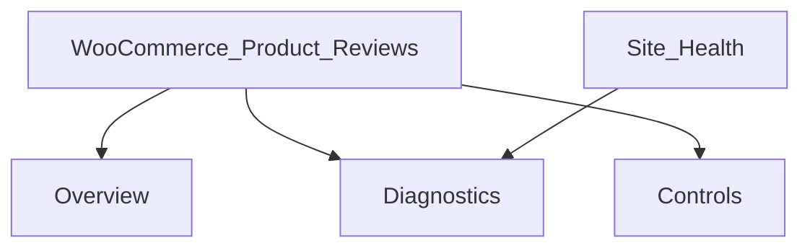

# M4 — Operator Controls and Diagnostics (authoritative freeze)

**Status:** Frozen M4.1 product specification. **Does not** authorise production rollout, host deploy, or customer contact.  
**Baseline:** Universal Product Reviews annotated **`v0.3.0`**.  
**Release target (after implementation):** **`v0.4.0`**.  
**Freeze tag:** `m4-operator-controls-and-diagnostics-freeze` (annotated; peels to the merge commit of this document).  
**Capability:** `manage_woocommerce` only.

Generic core only: no host-, brand-, theme-, provider-, or infrastructure-specific runtime code. No WooCommerce `Internal\*` APIs. No mint/resend/token workaround APIs.

---

## 1. Scope (M4.1 work packages)

| WP | Deliverable |
|----|-------------|
| **WP1** | Overview tab: control badges; open workload (including old still-active invitation rows); recent lifecycle activity (bounded window); recent audit (allowlisted fields only); last non-dry-run reconciliation; shortcuts |
| **WP2** | Diagnostics **D1–D11** only; safe actions = existing controls, reconcile, controlled DB upgrade |
| **WP3** | Site Health tests (public APIs only; no external HTTP) |
| **WP4** | Controls tab (extend existing settings model): Disabled / Paused / Not authorised; confirmations; enable/disable audit; controlled DB upgrade; reconcile UI |
| **WP5** | Operator runbook, troubleshooting updates, capability map, fixed allowlisted **local** support export |

**Non-goals:** production rollout; host adapters; storefront; moderation queue; AI; mint/resend; `Internal\*`; PII/token/URL/comment exposure; multi-step install wizard; AS deep browser; changing `delayed` due-query/reconcile promotion; **host-policy delivery diagnostics** (e.g. `shipped_fallback` / high-fallback share — not generic UPR).

---

## 2. Information architecture

Native WordPress admin under existing WooCommerce submenu slug `universal-product-reviews`:

- **Overview** (default)
- **Diagnostics**
- **Controls** (evolve current settings page; do not create a second settings model)

No React SPA.

---

## 3. Last reconciliation

**Source of truth:** newest `{prefix}upr_audit` row with `event_type = 'reconcile.completed'` (written only on non-dry-run reconcile).

- If present: show `occurred_at` and allowlisted counters from that row’s payload.
- If absent: show exactly **“No recorded run.”** Do not invent timestamps from dry-runs, AS presence, or options.

**D10** applies only when invitation emails are enabled **and** emergency pause is off; age from that same audit row; no recorded run in that state ⇒ warning.

---

## 4. Privacy and support export

| Data | Admin UI (`manage_woocommerce`) | Support export |
|------|----------------------------------|----------------|
| Emails, raw tokens, invite URLs, `token_hash`, cookies, request bodies, comment bodies, free-text errors, raw `payload_json` | Never | Never |
| Order IDs / order item IDs | Restricted operational data — admin UI only | **Never** |
| Aggregates, event_type, actor_type, control flags, allowlisted error codes, reconcile counters | Yes | Yes (allowlist only) |

**Support export (fixed contract):**

- Local download only (no email, no remote post).
- Schema version string fixed in code; default evidence window **seven days**.
- Allowlisted fields only: plugin version, schema version option, emails enabled, pause on/off, boundary-set boolean, diagnostic IDs + severities + statuses, bounded counts (lifecycle totals, `email.failed` count, stale-claim counts), last `reconcile.completed` counters + timestamp **or** `no_recorded_run`.
- Excluded: order IDs, item IDs, emails, tokens, URLs, comments, payloads, product names, AS action arguments, free text.

---

## 5. Query budgets and degradation

Ordinary Overview / Diagnostics / Site Health loads **must not** full-scan audit or Action Scheduler tables.

- Lifecycle / open-work: bounded aggregates; **current open-work counts must include old still-active invitation rows** (not only rows updated in a recent window).
- Recent lifecycle activity: bounded recent window (e.g. 30 days) for activity charts/lists separate from open-work totals.
- Recent audit UI: `ORDER BY id DESC LIMIT 25` maximum.
- D9: single `COUNT(*)` on `event_type = 'email.failed'` for default **24h** window.
- Last reconcile: `ORDER BY id DESC LIMIT 1` for `reconcile.completed`.
- AS (D6): at most one bounded `as_get_scheduled_actions` call (`per_page` cap, e.g. 50). Present counts as **“at least N”** when capped, or **“unavailable”** if APIs missing/fail — **never** imply exhaustive inventory.
- Cache aggregates/diagnostics in a site transient **≤ 60 seconds**; invalidate after control changes, successful reconcile, successful DB upgrade.
- On query/API failure: option-backed control status + mark dependent diagnostics **unavailable** (unavailable is never critical).

---

## 6. Controlled database upgrade

- **Never** run migrator on admin page load.
- Explicit action only: `manage_woocommerce`, dedicated nonce, **confirmation**, then existing `Migrator::upgrade_now()` + controlled rewrite flush.
- Verify `upr_db_version` equals `Schema::DB_VERSION` after the action.
- Audit success/failure with actor_id + from/to version strings — no sensitive data.

---

## 7. Diagnostics catalogue (D1–D11 only)

| ID | Condition | Severity | Evidence |
|----|-----------|----------|----------|
| D1 | Invitation emails disabled | information | option |
| D2 | Emergency pause active | **warning** | option + meta (may be deliberate) |
| D3 | Scheduling boundary unset | **warning only when** emails enabled **and** unpaused; suppress when emails disabled | option |
| D4 | Schema behind | warning | `upr_db_version` vs `Schema::DB_VERSION` |
| D5 | Action Scheduler APIs missing | warning | `function_exists` |
| D6 | Failed/overdue UPR AS work | warning | bounded public AS APIs → **“at least N”** or **unavailable** |
| D7 | Stale send claims | warning | bounded invite SQL |
| D8 | Expired submit claims | warning | bounded invite SQL |
| D9 | Elevated `email.failed` | warning if `COUNT` ≥ **5** in **24h** | `{prefix}upr_audit` `event_type = 'email.failed'` (BundleSender / ReminderSender) |
| D10 | Reconciliation overdue | warning | last `reconcile.completed` when emails on and unpaused |
| D11 | Overdue `delayed` past `delay_until` | warning | bounded invite SQL; **detect only** — do not alter due-query/reconcile |

Statuses: **pass**, **warning**, **information**, **unavailable**. Unavailable ≠ critical.

Safe actions only: Controls (enable/pause), reconcile dry-run→apply, controlled DB upgrade. No resend, token mint, or lifecycle workaround.

---

## 8. Controls (WP4)

Extend existing settings experience:

- Distinguish **invitation emails disabled**, **emergency pause active**, and **sending not authorised** (host filter / authorisation — explanatory, not a toggle).
- Preserve fail-closed email default, pause precedence, scheduling-boundary semantics, no retro-send on enable/unpause.
- Mutations require `manage_woocommerce`, nonce, and **explicit confirmation** for: enable emails, pause, reconcile apply, database upgrade.
- Audit: `invite.emails_enabled`, `invite.emails_disabled` (plus existing pause/unpause events).

---

## 9. Site Health (WP3)

| Test | Type |
|------|------|
| Schema current | recommended |
| WooCommerce active | critical |
| Action Scheduler APIs present | recommended |
| Emergency pause active | recommended (warning when paused; not critical) |
| Invitation email status | recommended (disabled is informational) |

No external HTTP. No sensitive details.

---

## 10. Documentation (WP5)

- `docs/runbooks/operator-controls.md` (new)
- Updates to invitation-failures and reconciliation runbooks
- Capability map
- Support-export contract documentation

---

## 11. Implementation and release

1. Implement M4.1 against this freeze (feature branch / reviewable PR).
2. Targeted unit + integration tests for admin actions, audit, diagnostics, migration action, export privacy, no page-load migration, AS “at least/unavailable”, open-work includes old active rows.
3. Tag release **`v0.4.0`** only after implementation acceptance (separate from this freeze tag).

## Amendment boundary

Changes to M4.1 scope require a new freeze amendment. Host-policy diagnostics remain out of scope.
